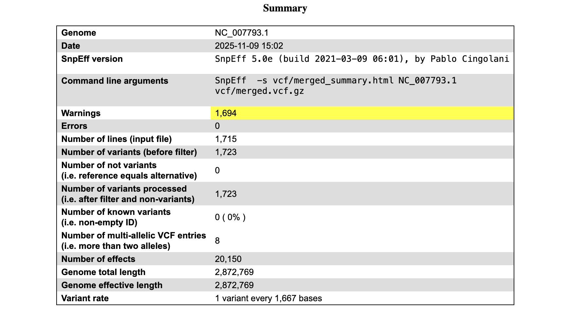
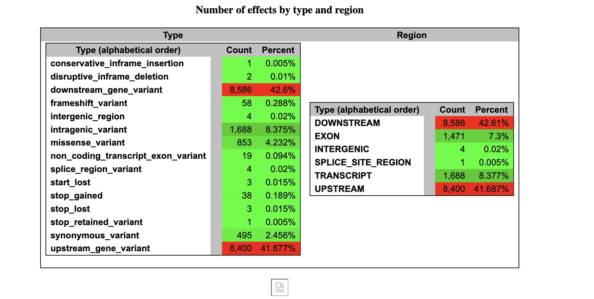

This assignment reuses the automated code from Weeks 9 and 10 and generates a VCF file. 
3 unique variants from the VCF file evaluated using snpEFF. 

**The work flow for this pipeline is:**

1. Collect the FASTQ reads and reference genome
2. Align FASTQ reads with the reference genome
3. Use alignment software to produce a BAM file
4. Call variants by comparing the aligned BAM file to the reference genome
5. Produce VCF files
6. Merge VCF files 
7. Evaluate 3 unique variants using snpEff

**Additional information:**
- The reference genome used in this workflow is **NC_007793.1 *Staphylococcus aureus* strain USA_300**

## Part I: Download and index the reference genome, make a design.csv using read data, and generate a VCF file

- Each step of the individual Makefile is summarized below:

| Command | Description | Key Input(s) | Key Output(s) |
|----------|--------------|--------------|----------------|
| `make genome` | Downloads the reference genome (FASTA) and annotation (GFF) files for *Staphylococcus aureus* USA300 (NC_007793.1). | NCBI FTP URLs | `refs/MRSA-USA300.fa`, `refs/MRSA-USA300.gff` |
| `make index` | Builds an index of the reference genome for read alignment (using `bwa index` or `minimap2 -d`). | `refs/MRSA-USA300.fa` | Genome index files in `refs/` |
| `make design` | Saves SRA metadata and extrapolates key SRR data into a minimal design.csv file | | `design.csv` |
| `make reads` | Downloads raw sequencing reads for all SRA accessions listed in `design.csv`. | `design.csv` (with SRR IDs) | `reads/*.fastq.gz` |
| `make fastqc` | Runs FastQC on all reads to assess sequence quality before alignment. | `reads/*.fastq.gz` | `fastqc/*.html`, `fastqc/*.zip` |
| `make align` | Aligns reads to the reference genome and outputs sorted BAM files (via `bwa mem` or `minimap2` + `samtools sort`). | `reads/*.fastq.gz`, `refs/MRSA-USA300.fa` | `bam/*.bam` |
| `make stats` | Summarizes alignment quality metrics using `samtools stats` or `samtools flagstat`. | `bam/*.bam` | `bam/*.stats.txt` |
| `make bigwig` | Generates normalized coverage tracks for visualization in IGV using `bamCoverage`. | `bam/*.bam` | `bigwig/*.bw` |
| `make vcf` | Calls variants (SNPs and indels) using `bcftools mpileup` and `bcftools call`, and merges them. | `bam/*.bam`, `refs/MRSA-USA300.fa` | `vcf/merged.vcf.gz`, `vcf/merged.vcf.gz.csi` |
| `make merge_vcf` | Merges all individual sample VCFs into a **multisample VCF**, indexes it, and generates variant statistics. | `vcf/*.vcf.gz` | `vcf/merged.vcf.gz`, `vcf/merged.vcf.gz.csi`, `vcf/merged_stats.txt` |
| `make all` | Runs the entire pipeline: genome download → index → reads → fastqc → align

#### **GNU parallel can be used to run multiple SRRs from make all:**

```bash
cat design.csv | parallel --colsep , --header : -j 2 "make all SAMPLE={sample} SRR={SRR}"
```

## Part II: Establish the effects of variants using SnpEff

Each of the below steps can also be run using the Make commands:

| **Make Target** | **Command(s)** | **Purpose / Description** | **Output(s)** |
|------------------|----------------|-----------------------------|----------------|
| `check_variants` | `grep "^SN" ${VCF_DIR}/merged_stats.txt \| head -n 15` | Verifies that the merged VCF contains expected numbers of variants (SNPs, indels, etc.). | Prints summary to terminal. |
| `snpeff_build` | `snpEff build -gff3 -v ${ACC}` | Builds a **custom SnpEff genome database** from `${REF}` (FASTA) and `${GFF}` (GFF3 annotation). | Creates database in `~/.snpEff/data/${ACC}/`. |
| `annotate_variants` | `snpEff ann -v -s ${VCF_DIR}/merged_summary.html ${ACC} ${VCF_DIR}/merged.vcf.gz > ${VCF_DIR}/merged.ann.vcf` | Annotates variants in the merged VCF using the SnpEff database for `${ACC}`. | `merged.ann.vcf` and HTML report in `${VCF_DIR}/`. |
| `annotate_summary` | `grep "ANN=" ${VCF_DIR}/merged.ann.vcf \| cut -f8 \| grep -o "HIGH\|MODERATE\|LOW\|MODIFIER" \| sort \| uniq -c` | Counts how many variants fall into each predicted impact class (HIGH, MODERATE, LOW, MODIFIER). | Prints counts to terminal. |
| `open_summary` | `open ${VCF_DIR}/merged_summary.html` | Opens the interactive HTML summary of SnpEff results (macOS). | Launches HTML report in browser. |

#### 1. After merging my VCF files, I doublechecked for variants in my results and confirmed I had at least 3 or more variants to work with:
```bash
make check_variants
```
**Output:**
```bash
SN	0	number of samples:	6
SN	0	number of records:	1715
SN	0	number of no-ALTs:	0
SN	0	number of SNPs:	1644
SN	0	number of MNPs:	0
SN	0	number of indels:	71
SN	0	number of others:	0
SN	0	number of multiallelic sites:	8
SN	0	number of multiallelic SNP sites:	8
```

#### 2. For evaluation of variant effects using snpEff, the software was downloaded to my home directory:

```bash
wget https://snpeff.odsp.astrazeneca.com/versions/snpEff_latest_core.zip

unzip snpEff_latest_core.zip
```
#### 3. Next, I tried to download the reference *S. aureus* genome from snpEff but received an error on remote connectivity to the snpEff server. Instead, I built the reference genome NC_007793.1 into snpEff. 

```bash
make snpeff_build
 ```

**Output** (confirming genome was built):
```bash
#-----------------------------------------------
# Genome name : 'Staphylococcus_aureus_USA300'
# Genome version : 'NC_007793.1'
# Genes : 2816
#-----------------------------------------------
Done
```
I annotated and summmarized my variants (building a visual HTML summary of the results output):

```bash
make annotate_variants

make annotate_summary
```
**Output of summary:**
```bash
 101 HIGH
 496 LOW
 856 MODERATE
18697 MODIFIER
```

#### 4. I visualized my results using:
```bash
make open_summary
```
**Example output:**



#### 7. I picked 3 variants from my annotated output to analyze (one from High, Moderate, and Low categories):

| Position | Reference → Alt | Gene | Effect Type | Impact | Protein Change | Description |
|-----------|----------------|------|--------------|---------|----------------|--------------|
| 5879 | T → G | **gyrB** | stop_gained | **HIGH** | p.Tyr273* | Introduces a premature stop codon in DNA gyrase subunit B, likely truncating the protein and disrupting DNA supercoiling. |
| 2688 | T → A | **dnaN** | missense_variant | **MODERATE** | p.Leu169His | Substitution in the β-subunit of DNA polymerase III, possibly affecting replication clamp stability or enzyme interactions. |
| 4337 | C → G | **recF** | synonymous_variant | **LOW** | p.Arg133Arg | Silent mutation in the recombination/repair gene *recF*; does not alter amino-acid sequence, likely neutral. |


#### 8. All Make commands for variant effect evaluation using snpEff are run using: 

```bash
make run_ann
```