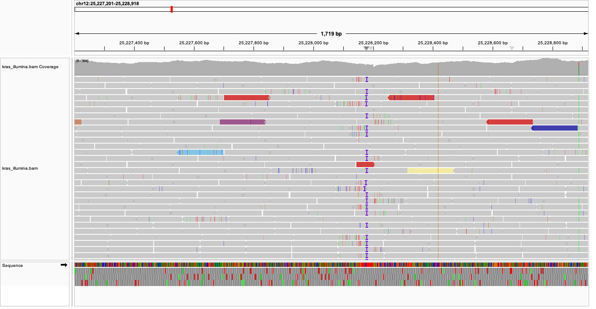
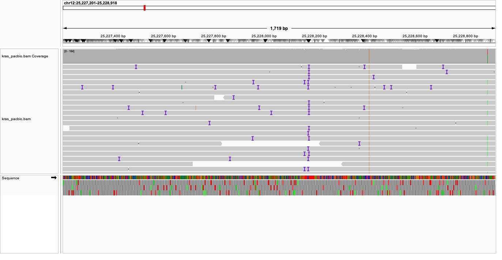

# Week 12: Evaluate data from the Cancer Genome in a Bottle project 
-----------

#### Option 1: Evaluate alignments across sequencing platforms

I chose to evaluate HG008-T KRAS region alignments from Oxford Nanopore, Illumina, and PacBio Revio.  

**Background**: The KRAS region is a highly mutagenic oncogene associated with several cancers, including pancreatic cancer. 

#### Makefile Summary

| Command | Description |
|---------|-------------|
| `make` | Runs all platforms: Illumina, PacBio, and ONT processing for the KRAS region. |
| `make illumina` | Extracts Illumina HG008-T reads for the KRAS region, indexes BAM, computes flagstat and depth. |
| `make pacbio` | Extracts PacBio HiFi HG008-T reads for KRAS, indexes BAM, computes flagstat and depth. |
| `make ont` | Extracts ONT ultra-long HG008-T reads for KRAS, indexes BAM, computes flagstat and depth. |
| `make ref` | Downloads and indexes the GRCh38 GIABv3 reference genome. |
| `make clean` | Removes all generated `refs/` and `bam/` files. |

## Results 
---------

#### Alignment Comparison Across Sequencing Platforms (HG008-T, KRAS Region)

| Metric | Illumina | PacBio HiFi | ONT Ultra-long |
|--------|----------|-------------|----------------|
| Total reads | 92,156 | 644 | 214 |
| Mapped (%) | 99.81% | 100% | 100% |
| Supplementary reads | 65 | 0 | 2 |
| Properly paired | 98.09% | N/A | N/A |
| Single-end / Paired | Paired-end | Single-molecule | Single-molecule |
| Expected read length | ~150 bp | 10–20 kb | 50 kb+ |
| Coverage behavior | Very uniform | Moderate, long-range | Lowest depth, longest spans |

#### Depth Comparison Across Sequencing Platforms (HG008-T, KRAS Region)

| Platform        | Mean Depth (×) | Notes |
|-----------------|----------------|-------|
| Illumina WGS    | **300.63×**    | Highest depth; very uniform coverage across KRAS |
| PacBio HiFi     | **182.80×**    | Strong long-read coverage; clean alignments with high accuracy |
| ONT Ultra-long  | **89.33×**     | Lowest depth but longest read spans; good structural context |

#### Illumina Visual Example (IGV)

#### PacBio Visual Example (IGV)

#### ONT Visual Example (IGV)

## Interpretation
----------

Depth profiles vary, however all three platforms have sufficient coverage for variant interpretation of the KRAS region (chr12:25,205,246-25,250,936). Illumina short-read sequencing produces the highest mean depth (300×) and has highly uniform coverage. PacBio HiFi has a medium depth (183×) but covers longer reads than Illumina. ONT ultra-long reads are the lowest depth (89×), but provide useful long-range context. 

