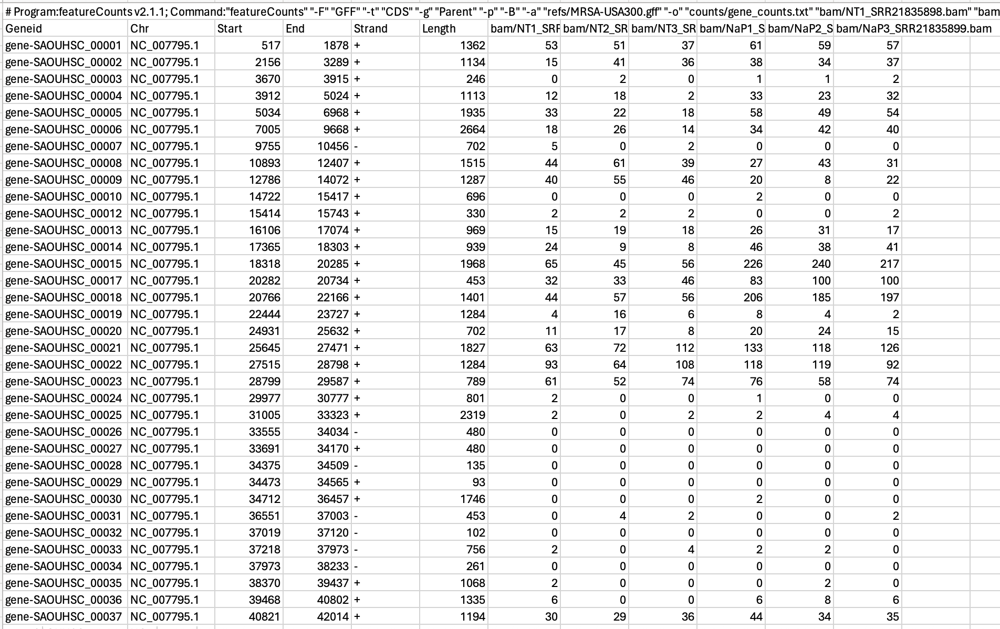
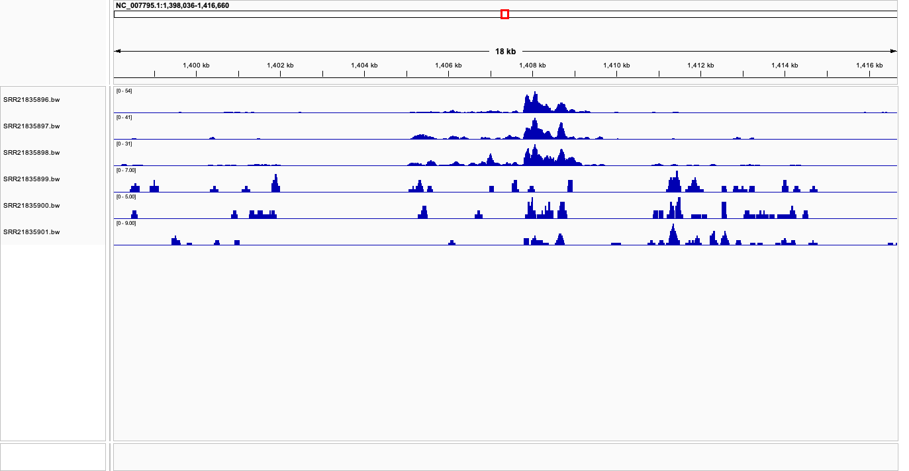

# Week 13: Generate an RNA-Seq count matrix

This workflow uses 6 RNA-Seq samples from BioProject PRJNA887926. 3 are designated as "control" and 3 as "treatment." 

### Summary of all Makefile targets

## Makefile Targets Overview

| Target        | Description |
|--------------|-------------|
| `design`     | Downloads SRA run metadata for the BioProject and generates a simplified `design.csv` |
| `refs`       | Downloads the *Staphylococcus aureus* USA300 reference genome (FASTA) and annotation (GFF), then generates the FASTA index (`.fai`) and chromosome sizes file required for downstream analyses |
| `index`      | Builds the BWA index files |
| `fastq`      | Downloads a subset of reads |
| `fastqc`     | Runs FastQC |
| `align`      | Aligns reads to the reference genome 
| `stats`      | Computes alignment statistics using `samtools flagstat` and estimates average read depth across the genome |
| `bigwig`     |  Converts BAM files into bedGraph format and then into BigWig format for visualization in IGV. |
| `coverage`   | Computes per-base sequencing depth across the genome using `samtools depth` |
| `counts`    | Uses `featureCounts` to generate a gene-level count matrix from all BAM files based on the reference GFF annotation |
| `all_samples` | Runs the full workflow |
| `clean`     | Removes intermediate files |


### **Step 1:** Make the Design.csv file

```bash
make design
```
This outputs:
| Sample              | SRR           | Condition  |
|---------------------|---------------|------------|
| NT1_SRR21835898     | SRR21835898   | Control    |
| NT2_SRR21835897     | SRR21835897   | Control    |
| NT3_SRR21835896     | SRR21835896   | Control    |
| NaP2_SRR21835900    | SRR21835900   | Treatment  |
| NaP3_SRR21835899    | SRR21835899   | Treatment  |
| NaP1_SRR21835901    | SRR21835901   | Treatment  |

### **Step 2:** Download the reference genome

```bash
make refs
```

### **Step 3:** Index the genome

```bash
make index
```

### **Step 4:** Run the complete pipeline for all 6 SRRs

```bash
make all_samples
```

This step will:

1. Download the reads
2. Run fastqc
3. Align the reads
4. Run stats 
5. Convert to bigwig
6. Generate a count matrix 

# Results

### Count Matrix 



The count matrix demonstrates how control/treatment groups cluster together and there are no blatant outliers (at least in the example subset provided). 

### Visualization with IGV



"Control" samples have dominant, central peaks while "treatment" samples have more spread out/fragmented expression. This suggests differential expression based on condition and that the data provided is RNA-seq data. 
This visualization is what would be expected after observing the data above in the count matrix table. 