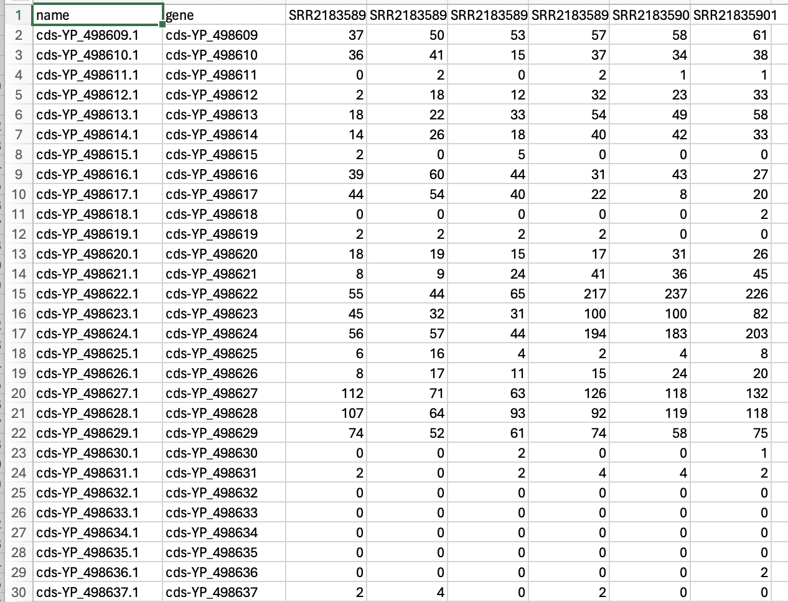
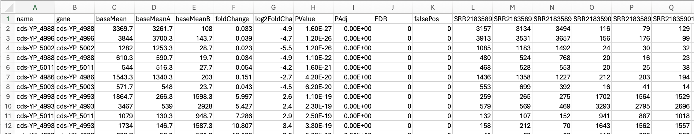
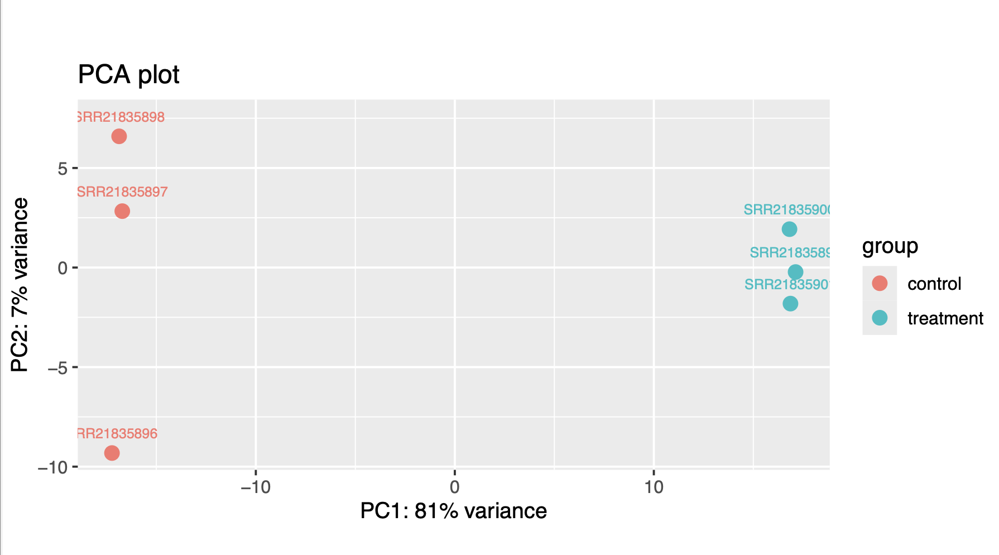
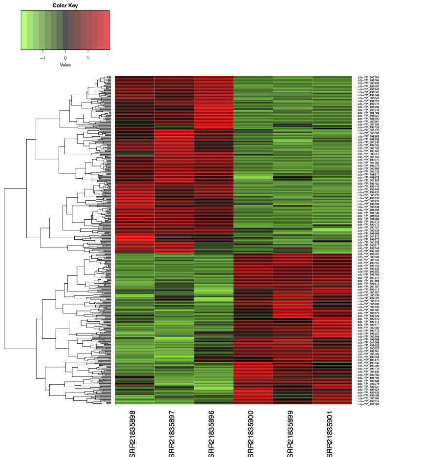

# Week 14: Perform an RNA-Seq differential gene expression study

### Assignment Summary
------

This week's assignment expanded upon code from Week 13 designed to run an RNA-seq pipeline. The expanded code includes a differential gene expression analysis using DeSeq2, and was used to generate PCA and heat plots of the data. 

### Re-Cap from Week 13:
-----
### Step 1: 

The first step in this pipeline was to generate a design.csv file where 3 SRR runs were grouped as treatment samples and 3 were grouped as control samples.

In the Makefile, this command is executed with:

```bash
make design
```

This outputs:
| sample        | condition |
|---------------|-----------|
| SRR21835896   | control   |
| SRR21835897   | control   |
| SRR21835898   | control   |
| SRR21835899   | treatment |
| SRR21835900   | treatment |
| SRR21835901   | treatment |

### Step 2:

The next step in this pipeline is to download and index the reference genome. Since the samples are RNA reads from the bacteria *Staphylococcus aureus*, indexing was built on the **genome** using **HISAT2** (better for RNA-seq because it's designed to handle uneven coverage/transcriptomic data).

These steps are executed using the make commands:

```bash
make refs
make index
```

### Step 3:

Next, the SRR reads were downloaded as FASTq files, underwent QC with FASTqc, and were aligned to the bacterial reference genome. Alignment statistics were run using **samtools** and bigwig files were generated for better visualization with IGV (demonstratetd in the README from Week 13). FeatureCounts was then used to generate a count matrix.

These commands are run sequentially for all reads using the make command:

```bash
make all_samples
```

The count matrix (counts.txt) was converted to counts.csv in the **stats enviroment**:

```bash
# download the bioinformatics toolbox
bio code 
# activate the stats environment
micromamba activate stats 
# convert .txt to .csv
Rscript src/r/format_featurecounts.r -c counts.txt -o counts.csv
```
An example output from the generated count matrix:



### Step 4:

EdgeR was run using the design.csv file and the generated counts.csv data. 

```bash
Rscript src/r/edger.r \
  -d design.csv \
  -c counts.csv \
  -f condition
```
A snippet of the EdgeR output is below:



### Step 5:

A PCA plot was created next using the Rscript code below. The code was adjusted to change "group" to "condition." Alternatively the design.csv could have been adjusted or the script itself, but this was easy to do in the moment. 

```bash
Rscript src/r/plot_pca.r \
  -c edger.csv \
  -d design.csv \
  -f condition
```
Output:


Principle component analysis demonstrates tight clustering of replicates by condition (treatment vs. control). There is 7% variance on PC2 due to vertical spread, particularly by SRR21835896. 

### Step 6: 

A heat map was generated using the edgeR.csv and count.csv data. 

```bash
Rscript src/r/plot_heatmap.r \
  -c edger.csv \
  -d design.csv \
  -f condition \
  -o heatmap.pdf
```
Output:


It is apparent that the first 3 groups (the control groups) cluster together, separate from the 3 treatment groups. This is especially clear from the heat map visualizaton with clustered regions of red (higher expression) and green (lower expression) by SRR number/condition. This is a strong visual example of differential expression. 

To identify differentially expressed genes, the below code was run:

```bash
# Identifies DE genes and creates a de_genes.csv file
awk -F, 'NR==1 || ($NF <= 0.05 && ($3 >= 1 || $3 <= -1))' edger.csv > de_genes.csv

# Counts the number of DE genes 
wc -l de_genes.csv

# Describes the identified DE genes
awk -F, 'NR==1 || NR<=7' de_genes.csv

# Separates the DE genes by down and/or upregulation
awk -F, 'NR>1 {
  if ($3 >= 1) up++
  else if ($3 <= -1) down++
}
END {
  print "Upregulated in treatment:", up
  print "Downregulated in treatment:", down
}' de_genes.csv
```
I identified 6 (upregulated) genes:

| Gene ID            | BaseMean | log2FC | P-value     | FDR        | Control Avg | Treatment Avg |
|--------------------|----------|--------|-------------|------------|-------------|----------------|
| cds-YP_500440.1    | 67.3     | -6.6   | 4.9e-13     | 0.0e+00    | 66.7        | 0.7            |
| cds-YP_499656.1    | 67.0     | -9.1   | 6.8e-13     | 0.0e+00    | 67.0        | 0.0            |
| cds-YP_500436.1    | 53.0     | -8.7   | 1.9e-12     | 0.0e+00    | 53.0        | 0.0            |
| cds-YP_500442.1    | 32.3     | -5.5   | 4.3e-09     | 0.0e+00    | 31.7        | 0.7            |
| cds-YP_500439.1    | 32.3     | -4.6   | 3.9e-08     | 0.0e+00    | 31.3        | 1.0            |
| cds-YP_499450.1    | 28.3     | -3.8   | 3.5e-07     | 3.0e-04    | 26.3        | 2.0            |


I could not get g:profiler or Enrichr to work (possibly because of the bacterial origin of my samples?), so Iopted instead to do a manual functional analysis. For this, I used the code below to see if these DE genes are expressed in an operon or adjacent to each other. I also identified the function of these genes. 

```bash
grep -Ff <(cut -d',' -f1 de_genes.csv | tail -n +2) refs/MRSA-USA300.gff
```

The output of this code demonstrated that these upregulated genes for the treatment condition are known bacterial virulence factors, ranging from host immune suppression, tissue invasion, and host neutrophil evasion. 

| Gene ID | Locus Tag | Protein Product | Virulence Function |
|-------|-----------|-----------------|-------------------|
| cds-YP_499656.1 | SAOUHSC_01112 | Formyl peptide receptor-like 1 inhibitory protein (FLIPr) | Immune evasion; inhibits neutrophil chemotaxis by blocking FPRL1 signaling |
| cds-YP_500442.1 | SAOUHSC_01942 | Serine protease SplA | Secreted protease involved in tissue damage and immune modulation |
| cds-YP_500440.1 | SAOUHSC_01939 | Serine protease SplC | Secreted virulence-associated extracellular protease |
| cds-YP_500439.1 | SAOUHSC_01938 | Serine protease SplD | Member of the Spl protease cluster; contributes to virulence |
| cds-YP_500436.1 | SAOUHSC_01935 | Serine protease SplF | Secreted protease implicated in host tissue degradation |
| cds-YP_499450.1 | SAOUHSC_00897 | Hypothetical protein | Function unknown; potential accessory or regulatory role |

