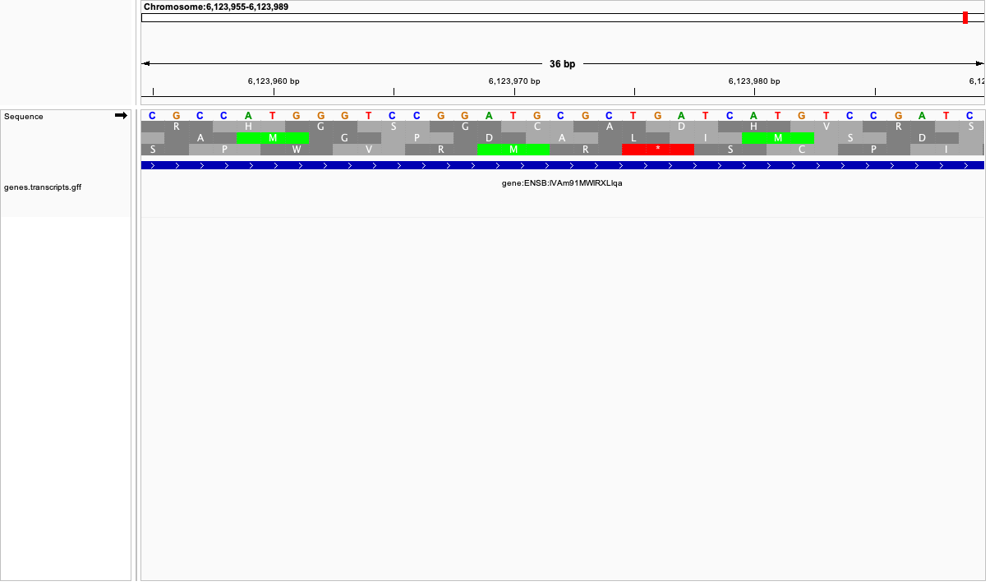
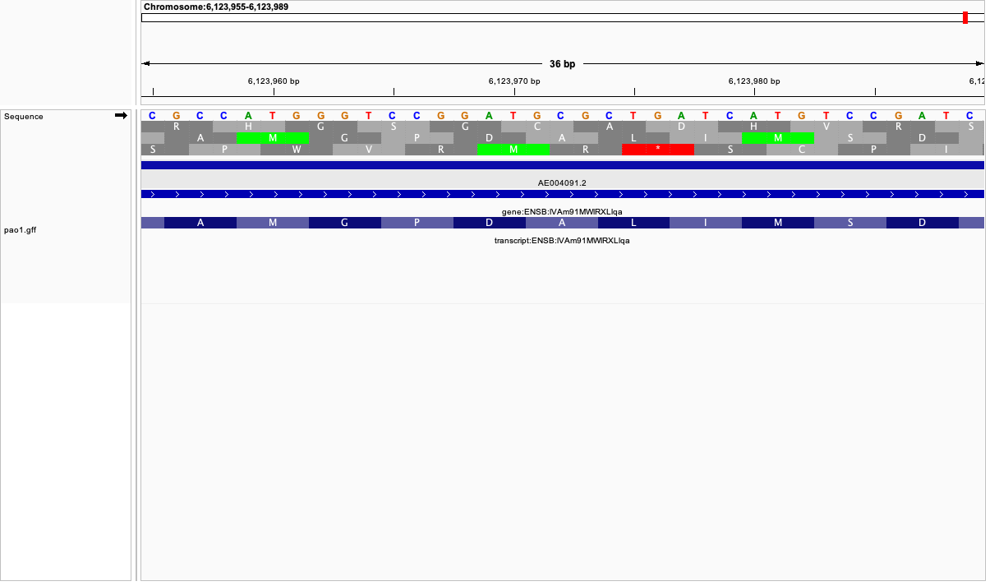
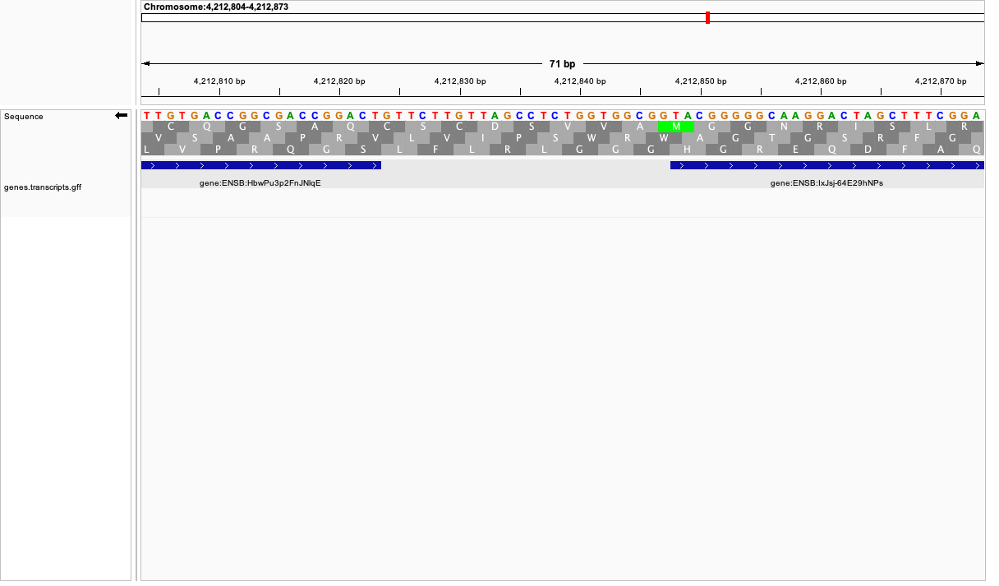
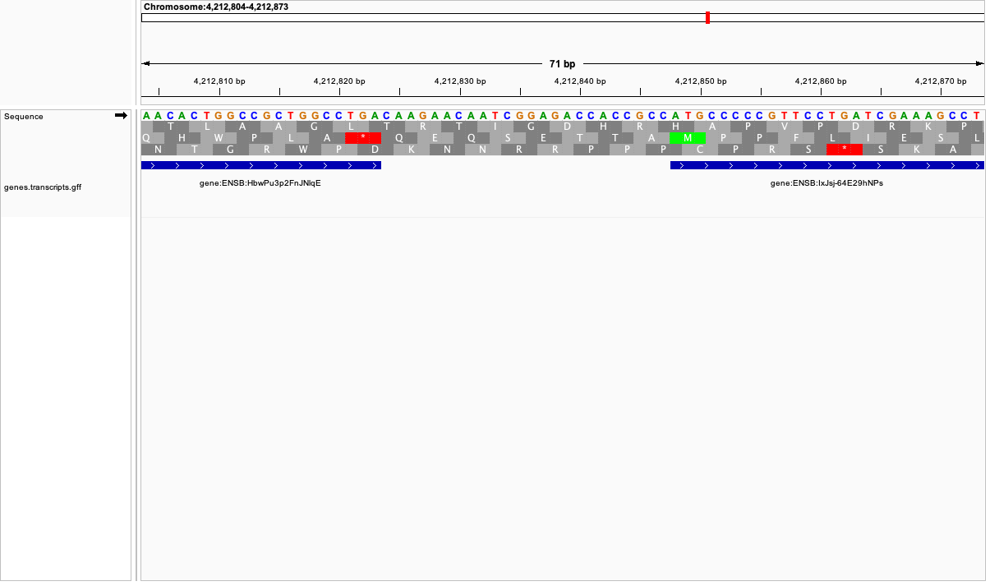

# Week 3 Assignment: Visualizing Genomic Data

### 1. Downloading bacterial genomic data from Ensembl

**Step 1**: I created an IGV file and used Ensembl to download the FASTA sequence file (top level DNA) and GFF3 coordinate data for *Pseudomonas aeruginosa* PAO1 (the type strain for *P. aeruginosa*), and then unzipped the file. 

```bash
mkdir igv
cd igv
wget https://ftp.ensemblgenomes.ebi.ac.uk/pub/bacteria/current/fasta/bacteria_5_collection/pseudomonas_aeruginosa_pao1_gca_000006765/dna/Pseudomonas_aeruginosa_pao1_gca_000006765.ASM676v1_.dna.toplevel.fa.gz
ls
gunzip Pseudomonas_aeruginosa_pao1_gca_000006765.ASM676v1_.dna.toplevel.fa.gz
```
**Step 2**: I changed the name of the unzipped file to a shorter, easier name:

```bash
mv Pseudomonas_aeruginosa_gca_001051345.PAMH19_.dna.toplevel.fa pao1.fa
```
**Step 3**: I ran seqkit stats to see size information related to the file: 

```bash
seqkit stats pao1.fa
file     format  type  num_seqs    sum_len    min_len    avg_len    max_len
pao1.fa  FASTA   DNA          1  6,264,404  6,264,404  6,264,404  6,264,404
```
**Step 4**: I was able to determine the pao1.fa file contains only one assembled chromosome:

```bash
 cat pao1.fa | grep ">"
>Chromosome dna:primary_assembly primary_assembly:ASM676v1_:Chromosome:1:6264404:1 REF
```

**Step 5**: I downloaded the GFF3 file, unzipped it, and renamed it:

```bash 
wget https://ftp.ensemblgenomes.ebi.ac.uk/pub/bacteria/current/gff3/bacteria_5_collection/pseudomonas_aeruginosa_pao1_gca_000006765/Pseudomonas_aeruginosa_pao1_gca_000006765.ASM676v1.62.gff3.gz
ls
gunzip Pseudomonas_aeruginosa_pao1_gca_000006765.ASM676v1.62.gff3.gz
ls
Pseudomonas_aeruginosa_pao1_gca_000006765.ASM676v1.62.gff3
pao1.fa
mv Pseudomonas_aeruginosa_pao1_gca_000006765.ASM676v1.62.gff3
pao1.fa pao1.gff
ls -1
pao1.fa
pao1.gff
```
### 2. Genome size and features 

The genome is 6,264,404 bps long. 

```bash
 grep "##sequence-region" pao1.gff
##sequence-region   Chromosome 1 6264404
```

### 3. Separating intervals of type "gene" or "transcript"

I used the awk command to extract exact instances of "gene" or "transcript" in rows. <br>
This returned 6571 genes and 0 transcripts, which makes sense because the annotation source (prokka) annotates mRNA/CDS/exons etc. as genes.

```bash
awk '$3=="gene" || $3=="transcript"' pao1.gff > genes.transcripts.gff

head genes.transcripts.gff

$ awk '$3=="gene" {g++} $3=="transcript" {t++} END {print "genes:", g, "transcripts:", t}' genes.transcripts.gff

genes: 5671 transcripts: 
```
Next, I determined the number and type of sequence regions:

```bash
 awk '{print $3}' pao1.gff | sort | uniq -c

 5780 
   1 1
5671 CDS
   1 Corporation
5776 exon
5671 gene
5671 mRNA
 105 ncRNA
 105 ncRNA_gene
   1 region
 ```

### 4. Visual differences between simplified and non-simplified GFF annotations

The simplified version has only genes, whereas the non-simplified contains sequence region data and some ncRNA. 

**Simplified**:



**Non-simplified**:


### 5. Strand orientation and gene start

Below is an example of a gene start site with methionine appearing in Frame 1, but encoded as TGA: 



By flipping the strand orientation, the methionine start codon ATG is now present in frame 2. Additionally, the appropriate stop codon (TGA) appears for the neighboring gene in frame 2. 


### 6. Visual verification of start and stop codons




