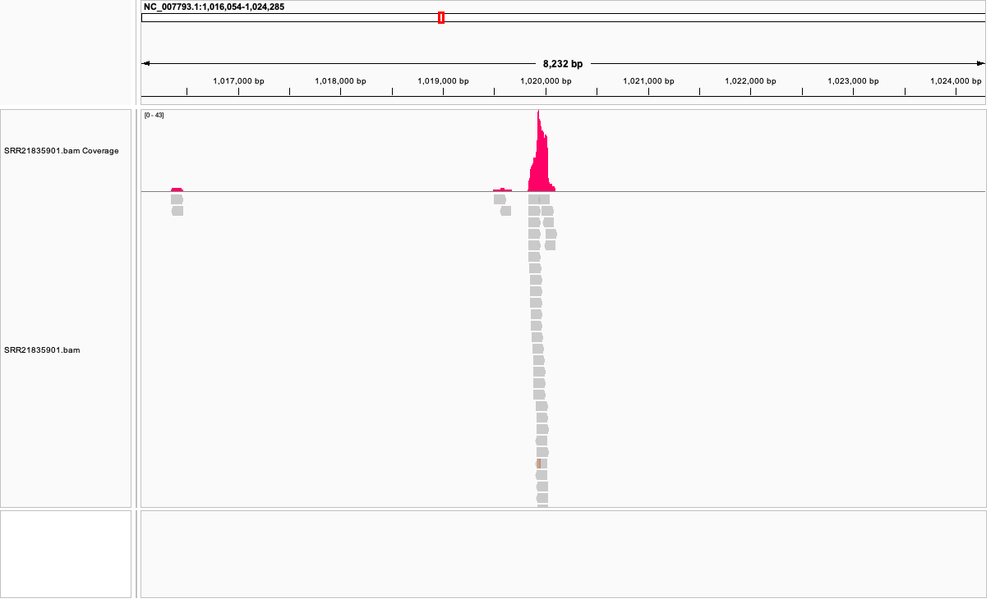

## Using Makefile to obtain the genome and sequencing reads from SRA 

Makefile uses targets, commands, and dependencies to execute scripts. Unlike with shell scripts, makefiles use dependency tracking rather than just executing code line by line. 

For this assignment, previous shell script used to download the genome and FASTq data for *Staphylococcus aureus* USA300 has been modified into a Makefile document, and additional steps for indexing and visualizing a BAM file have also been included. 

#### Step 1: Set the Makefile and establish variables 

```bash
SHELL=/bin/bash

# Execute all commands in a single shell
.ONESHELL:

# Run the shell with strict error checking.
.SHELLFLAGS = -eu -o pipefail -c

# Delete target files if the command fails.
.DELETE_ON_ERROR:

# Warn if a variable is not defined.
MAKEFLAGS += --warn-undefined-variables

# Disable built-in rules.
MAKEFLAGS += --no-builtin-rules

# ---------------------------

# Variables

# user-friendly name for genome
NAME=MRSA-USA300

#NCBI Genome accession number
ACC=NC_007793.1

# SRR accession number 
SRR=SRR21835901

# reference genome
REF=refs/${NAME}.fa

# reads directory
READS_DIR=reads

# read 1
R1=reads/${SRR}_1.fastq

# read 2
R2=reads/${SRR}_2.fastq

# bam file
BAM=bam/${SRR}.bam

# How many reads to download
N=10000
```
#### Step 2: Download and analyze the reference genome

usage:

```
make all
```

by default the script will use the following parameters:

so make all is equivalent to
```bash
make all SRR=SRR21835901
```

## Get genome

This makefile operates on NCBI Genbank accession numbers.
You can rename the genome to something more meaningful:

```bash
genome:
	# Step 1: Download the reference genome
	mkdir -p $(dir ${REF})
	bio fetch ${ACC} -format fasta > ${REF}
	# stats on the genome
	seqkit stats ${REF}
	echo "Reference genome REF=${REF}

analyze: download
	# Calculate expected coverage
	GENOME_SIZE=$$(seqkit stats -T -a ${REF} | awk 'NR==2 {print $$3}')
	READ_LEN=150
	EXP_COV=$$(echo "scale=2; ${N} * $$READ_LEN / $$GENOME_SIZE" | bc)
	echo "Genome size: $$GENOME_SIZE bp"
	echo "Expected coverage: $$EXP_COV x"
```
#### Step 3: Download and analyze SRA sequencing reads

# Get the fastq data

```bash
fastq:
	# Identify SRR accession numbers
	bio search PRJNA887926 -H --csv
	mkdir -p $(dir ${READS_DIR})
	# Download the reads
	fastq-dump -X ${N} -F --outdir reads --split-files ${SRR}
	mv reads/${SRR}_1.fastq ${R1}
	mv reads/${SRR}_2.fastq ${R2}
	echo "Download complete"
	# run stats
	seqkit stats ${R1} ${R2}

fastqc: fastq
	# run FastQC
	mkdir -p fastqc_reports
	fastqc -o fastqc_reports ${R1} ${R2}
```
The genome size is 2,872,769 bps, and the expected coverage is 974.02 x, or 2.8 billion bps (coverage = total bases sequenced / genome size). 

#### Step 4: Index and align the BAM file 

```bash
index:
	bwa index ${REF}

align:
	# make BAM directory
	mkdir -p $(dir ${BAM})
	# align reads to reference genome
	bwa mem -t 4 ${REF} ${R1} ${R2} | samtools sort > ${BAM}
	#index the BAM file
	samtools index ${BAM}

stats: 
	# Expected coverage
	GENOME_SIZE=$$(seqkit stats -T -a ${REF} | awk 'NR==2 {print $$3}')
	READ_LEN=150
	NUM_READS=$$(samtools view -c ${BAM})
	EXP_COV=$$(echo "scale=2; $$NUM_READS * $$READ_LEN / $$GENOME_SIZE" | bc)
	echo "Genome size: $$GENOME_SIZE bp"
	echo "Number of reads: $$NUM_READS"
	echo "Expected coverage: $$EXP_COV x"

	# Percentage of reads aligned
	PCT_ALIGNED=$$(samtools flagstat ${BAM} | awk -F '[()]' '/mapped/ {print $$2; exit}')
	echo "Percent reads aligned: $$PCT_ALIGNED"

	# Observed coverage
	OBS_COV=$$(samtools depth ${BAM} | awk '{sum+=$$3} END {print sum/NR}')
	echo "Observed coverage: $$OBS_COV x"

	# Coverage variation (text summary)
	echo "Coverage distribution (coverage -> # of positions):"
	samtools depth ${BAM} | awk '{print $$3}' | sort | uniq -c | sort -nr
```
- The expected coverage is 1948.83 x

- The average coverage is 99.74%

- The observed average coverage is 4.36095

- The coverage variation was very high when looking at the full genome in IGV vs. the high coverage stemming from only sampling 10,000 reads. In IGV, there were many spaces where coverage was poor. 



#### Step 5: Clean 

```bash 
clean:
	# clean up generated files
	rm -rf ${REF} ${R1} ${R2} ${BAM} ${BAM}.bai


.PHONY: all refs fastq index align clean stats
	# create necessary directories
```